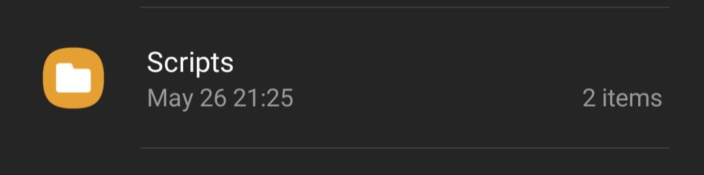
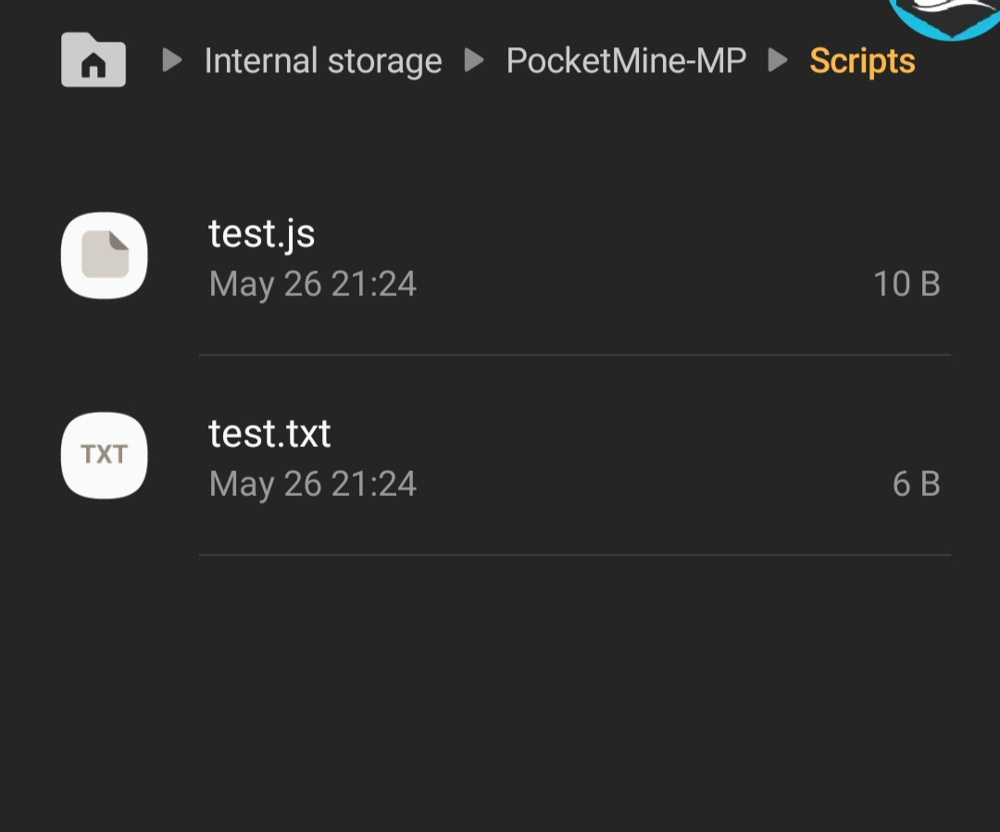

# PMMP-JS
## ! WELCOME FROM 7WDEV(7Wstore owner) !

#### How To Use?
1-just install the plugin from 7Wstore (also if you want you can install it from github) !

2-put this plugin in the plugins folder :
```
Server\plugins\PMMP-JS.phar
                      |
                     \ /
              this is the plugin
              _________________
```
3-enjoy !


I started to develop this project for free and for all so please don't fake/steal the ownership, you're a javascript developer and you are enjoying coding mcbe plugins but you have not enough knowledge in php?
No problem, with this plugin you can load js scripts inside your pmmp server!
After you run this plugin you will notice that there will be a folder called "Scripts" in your server dir, there you should put your scripts - example: "Server/Scripts/yourscript.js"...
NOTICE: if your script was loaded that doesn't mean that your code is clean and your script is working !

if you like to support this project, your welcome thank you then ;)

[](https://paypal.me/AdeIssawe)

  

* [7Wstore](#) - plugin installing link from 7Wstore !


#### Info
plugin developed by : 7awariGamer[7Wdev] !

simple support for javascript in pmmp !

currently no debug system !

i will release an apidoc after the project be done !

this plugin works with reducing lag system !

this is a free plugin for all pmmp users !

it is working with 3.0.0 api !


